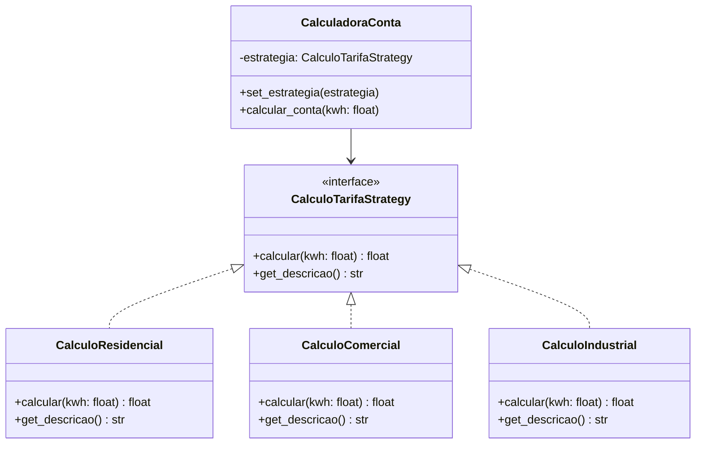
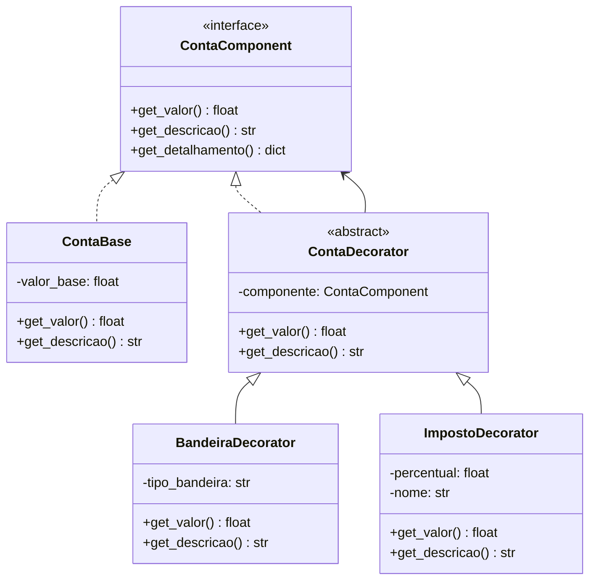
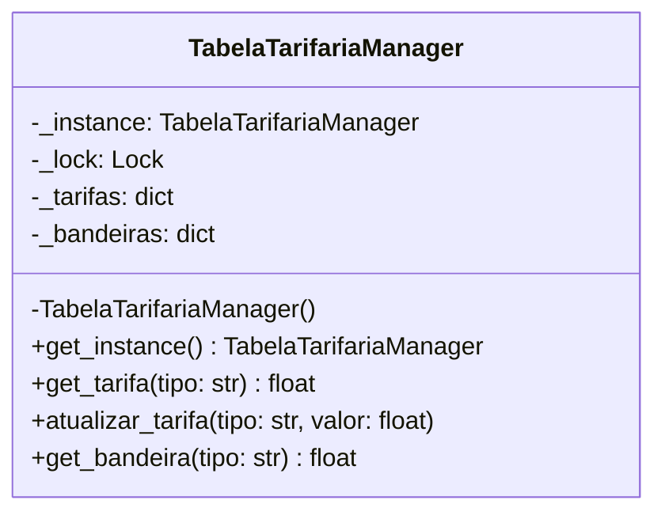

# Sistema de Faturamento de Energia Elétrica ⚡

**Desenvolvido por:** Carlos Henrique Andrade Weege ([@CarlosWeg](https://github.com/CarlosWeg))

## 📋 Descrição do Projeto

Sistema completo para cálculo de faturamento de energia elétrica, implementando três padrões de projeto (Design Patterns) para resolver problemas reais do domínio de cobrança de energia.

### Problema do Domínio

O sistema de faturamento de energia elétrica possui complexidades que tornam os padrões de projeto essenciais:

1. **Múltiplas formas de cálculo**: Diferentes faixas de consumo (residencial, comercial, industrial) têm tarifas distintas
2. **Custos adicionais em camadas**: Bandeiras tarifárias, impostos e taxas que se acumulam sobre o valor base
3. **Configuração centralizada**: Tabelas tarifárias que devem ser únicas e consistentes em todo o sistema

## 🎯 Padrões de Projeto Implementados

### 1. Strategy Pattern (Estratégias de Cálculo)

**Problema:** Diferentes tipos de consumidores (residencial, comercial, industrial) têm regras de cálculo distintas baseadas em faixas de consumo.

**Solução:** O padrão Strategy permite trocar dinamicamente o algoritmo de cálculo sem modificar o código cliente.

**Implementação:**
- `CalculoTarifaStrategy` (interface): Define o contrato para cálculo
- `CalculoResidencial`: Implementa cálculo progressivo por faixas
- `CalculoComercial`: Implementa tarifa fixa com desconto progressivo
- `CalculoIndustrial`: Implementa tarifa com descontos por volume

**Diagrama:**


**Por que resolve:** Permite adicionar novos tipos de cálculo sem modificar código existente (Open/Closed Principle) e trocar estratégias em runtime.

---

### 2. Decorator Pattern (Custos Adicionais)

**Problema:** Sobre o valor base da energia, precisamos aplicar múltiplos custos adicionais (bandeiras tarifárias, impostos) de forma flexível e composível.

**Solução:** O padrão Decorator permite adicionar responsabilidades dinamicamente, empilhando decoradores.

**Implementação:**
- `ContaComponent` (interface): Define a interface comum
- `ContaBase`: Implementação básica do componente
- `BandeiraDecorator`: Adiciona custo de bandeira (verde/amarela/vermelha)
- `ImpostoDecorator`: Adiciona impostos (ICMS, PIS/COFINS)
- `TaxaIluminacaoDecorator`: Adiciona taxa de iluminação pública

**Diagrama:**


**Por que resolve:** Permite compor custos de forma flexível, mantendo o princípio Single Responsibility e permitindo adicionar/remover custos dinamicamente.

---

### 3. Singleton Pattern (Tabela Tarifária)

**Problema:** A tabela de tarifas do mês deve ser única e consistente em toda a aplicação, evitando múltiplas instâncias com valores diferentes.

**Solução:** O padrão Singleton garante uma única instância global com acesso controlado.

**Implementação:**
- `TabelaTarifariaManager`: Gerencia tarifas com construtor privado
- Thread-safe com Lock
- Métodos para atualização e consulta de tarifas

**Diagrama:**


**Por que resolve:** Garante consistência dos dados tarifários, economiza memória e fornece um ponto global de acesso thread-safe.

---

## 🏗️ Estrutura do Projeto

```
energia-faturamento/
├── README.md
├── requirements.txt
├── main.py
├── domain/
│   └── conta.py                 # Entidades do domínio
├── strategies/
│   ├── __init__.py
│   └── calculo_tarifa.py        # Estratégias de cálculo
├── decorators/
│   ├── __init__.py
│   └── conta_decorators.py      # Decoradores de custos
├── infra/
│   ├── __init__.py
│   └── tabela_tarifaria.py      # Singleton
├── app/
│   ├── __init__.py
│   └── interface.py             # Interface Tkinter
└── tests/
    ├── __init__.py
    ├── test_strategy.py
    ├── test_decorator.py
    └── test_singleton.py
```

## 🚀 Como Executar

### Pré-requisitos

- Python 3.8 ou superior
- Tkinter (geralmente já incluído no Python)

### Instalação

1. Clone o repositório:
```bash
git clone https://github.com/CarlosWeg/energia-faturamento.git
cd energia-faturamento
```

2. Instale as dependências:
```bash
pip install -r requirements.txt
```

Observação: No Windows, às vezes o comando direto pip dá erro se as configurações de caminho (PATH) estiverem bagunçadas. Por isso, a forma mais segura de usar no Windows é conforme a seguir:

```bash
python -m pip install -r requirements.txt
```

### Execução

Execute o sistema com interface gráfica:
```bash
python main.py
```

### Executar Testes

Execute todos os testes:
```bash
python -m pytest tests/ -v
```

Execute testes específicos:
```bash
python -m pytest tests/test_strategy.py -v
python -m pytest tests/test_decorator.py -v
python -m pytest tests/test_singleton.py -v
```

## 🧪 Casos de Teste Implementados

### Strategy Pattern
-  Troca dinâmica de estratégias
-  Cálculo correto por faixas (residencial)
-  Aplicação de descontos (comercial/industrial)
-  Múltiplas instâncias com estratégias diferentes

### Decorator Pattern
-  Composição de múltiplos decoradores
-  Ordem de aplicação dos decoradores
-  Cálculo correto de impostos em cascata
-  Detalhamento completo da conta

### Singleton Pattern
-  Unicidade da instância
-  Thread-safety em acesso concorrente
-  Persistência de dados entre chamadas
-  Atualização global de tarifas

## 💡 Decisões de Design

### Por que Python + Tkinter?

- **Python**: Linguagem orientada a objetos com suporte robusto a padrões de projeto
- **Tkinter**: Interface gráfica nativa, cross-platform e sem dependências externas

### Organização em Camadas

A estrutura segue princípios de Clean Architecture:
- **Domain**: Entidades e lógica de negócio
- **Strategies/Decorators**: Padrões comportamentais
- **Infra**: Serviços de infraestrutura (Singleton)
- **App**: Interface com usuário

### Princípios SOLID Aplicados

- **Single Responsibility**: Cada classe tem uma única razão para mudar
- **Open/Closed**: Aberto para extensão (novos decoradores/estratégias) sem modificar código existente
- **Liskov Substitution**: Estratégias e decoradores são intercambiáveis
- **Interface Segregation**: Interfaces mínimas e focadas
- **Dependency Inversion**: Dependência de abstrações, não de implementações

## 📚 Referências

- **Gamma et al.** (1994). Design Patterns: Elements of Reusable Object-Oriented Software
- **Martin, R.** (2017). Clean Architecture: A Craftsman's Guide to Software Structure and Design
- **Documentação Python**: https://docs.python.org/3/

## 📝 Licença

Este projeto foi desenvolvido para fins acadêmicos.

---

**Trabalho 04 - Design Patterns**  
Universidade do Alto Vale do Itajaí (UNIDAVI)
Desenvolvido por: Carlos Henrique Andrade Weege